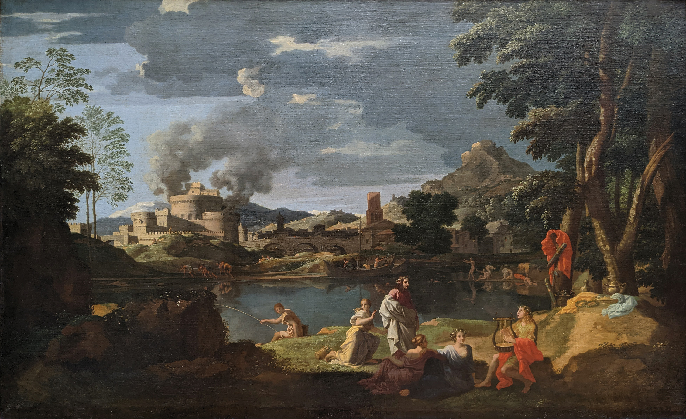

<figcaption>
Nicolas Poussin, <i>Orphée et Eurydice</i>.
Musée du Louvre.
<a href="https://commons.wikimedia.org/wiki/File:Orph%C3%A9e_et_Eurydice_-_Nicolas_Poussin_-_Mus%C3%A9e_du_Louvre_Peintures_INV_7307.jpg">Source</a>
</figcaption>

# Eurydice

Eurydice is a compiler from Rust to C. The purpose of Eurydice is to provide a
backwards-compatibility story as the verification ecosystem gradually
transitions to Rust. New programs can be written in Rust, in turn making them
safer and easier to verify; but for legacy environments that cannot yet take a
dependency on the Rust toolchain, Eurydice allows generating C code as a stopgap
measure.

Currently (late 2023), the flagship example for Eurydice is Kyber, a
Post-Quantum cryptographic algorithm authored and
verified in Rust for the general public, and [compiled to C via
Eurydice](https://github.com/cryspen/hacl-packages/tree/7a7bfbb17d1d912bdb1a80e86a917e1eec8b6264/libcrux/src)
for Mozilla's NSS library.

In terms of software architecture, Eurydice consumes Rust programs via the
[Charon](https://github.com/AeneasVerif/charon) infrastructure, then extracts
Rust to [KaRaMeL](https://github.com/FStarLang/karamel)'s internal AST via a
type-driven translation. Once in the KaRaMeL AST, 30+ nano-passes allow going
from Rust down to C code. About half of these passes were already implemented
for KaRaMeL, the rest of the passes reuse the KaRaMeL infrastructure but were
freshly written for Eurydice.

If you want to contribute or ask questions, we strongly encourage you to join
the [Zulip](https://aeneas-verif.zulipchat.com/).
